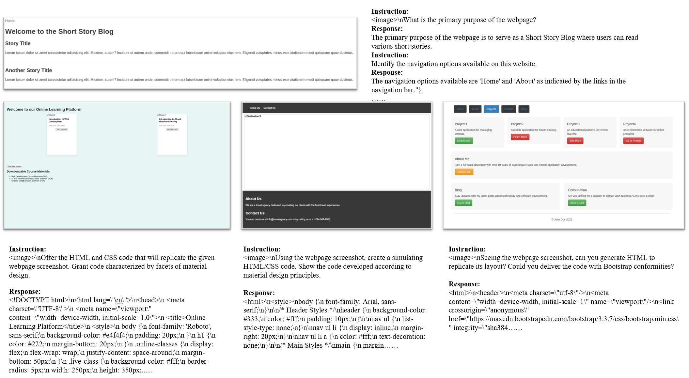

# Web2Code: A Large-scale Webpage-to-Code Dataset and Evaluation Framework for Multimodal LLMs

---

Official implementation of **ShareGPT4V: Improving Large Multi-modal Models with Better Captions**.
<p align="center">
  
</p>

- **Institutes**: Mohamed bin Zayed University of Artificial Intelligence
- **Resources**: [[Paper]()] [[Project Page](https://mbzuai-llm.github.io/webpage2code/)] [[Web2Code Dataset]()]

## 📜 News
**[2024/6/5]** The [paper]([Web2Code.pdf]()) and [project page](https://mbzuai-llm.github.io/webpage2code/) are released!

## ❤️ Acknowledgments
- [LLaVA](https://github.com/haotian-liu/LLaVA): the codebase we built upon. Thanks for their wonderful work.
- [WebSRC](https://x-lance.github.io/WebSRC/): the amazing open-sourced large language model!

## ✒️ Citation
If you find our work helpful for your research, please consider giving a star ⭐ and citation 📝
```bibtex
update soon
```

## License
 **Usage and License Notices**: Usage and License Notices: The data is intended and licensed for research use only.  The dataset is CC BY NC 4.0 (allowing only non-commercial use) and models trained using the dataset should not be used outside of research purposes.
